# Plataforma de Avaliação das Turmas EaD com Correção Automática (Patec) ​

Modelo virtual de folha de respostas, em que os alunos registrarão suas respostas e, após as enviarem, o sistema corrigirá a prova automaticamente, salvando as respostas e a nota do aluno em um banco de dados. Dessa forma, os coordenadores das turmas não têm a necessidade de corrigir as provas manualmente, podendo simplesmente acessar os relatórios das avaliações que estarão disponíveis em nossa plataforma para enviar as notas para o CPS e o SIGA.

## Como contribuir:

### Primeiro passo: Clonando o repositório remoto:

1. Clique no botão *"Code"*, no início da página;
2. Com a opção "HTTPS" selecionada, copie o link;
3. Abra o terminal do Git no diretório desejado;
4. Você pode digitar os seguintes comandos:

```bash
# Para clonar o repositório na branch principal:
git clone https://github.com/VictoriaMiki/3Semestre-Patec.git
```

ou:

```bash
# Para clonar uma branch específica de um repositório (no exemplo, estamos clonando a branch 'telas'):
git clone -b telas https://github.com/VictoriaMiki/3Semestre-Patec.git
```

### Segundo passo: Abrindo o *workspace* no Eclipse:

- Caso você inicie o Eclipse e a janela de seleção de *workspace* não apareça automaticamente, na aba de ferramentas clique em ***File>Switch Workspace>Other...***

- Em seguida, clique em *"Browse"* para procurar o repositório.

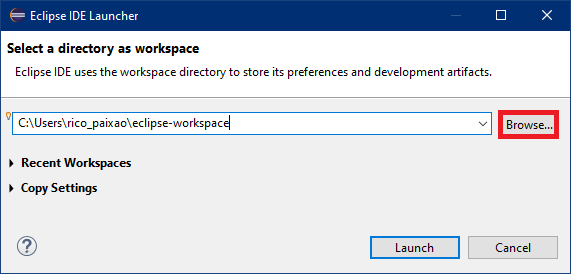

- Selecione-o, e clique em *"Launch"*.

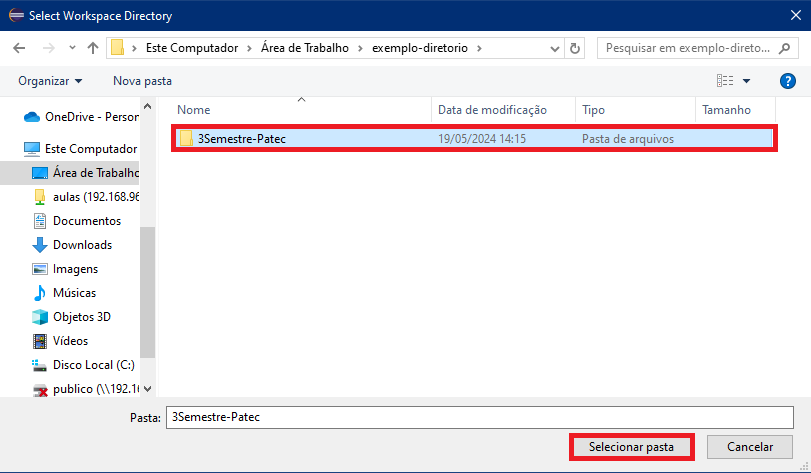

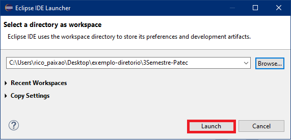

### Terceiro passo: Importando o projeto Maven:

Normalmente, importaríamos um projeto Java para o Eclipse. Entretanto, pelo fato da Patec ser um projeto Maven, os passos de importação diferem levemente do usual, mas no fim das contas é um processo tão simples quanto. Veja como:

- Clique em *"Import projects..."*.

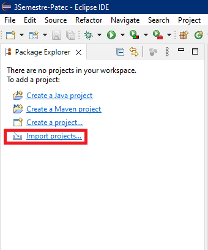

- Selecione *"Existing Maven Projects"*.

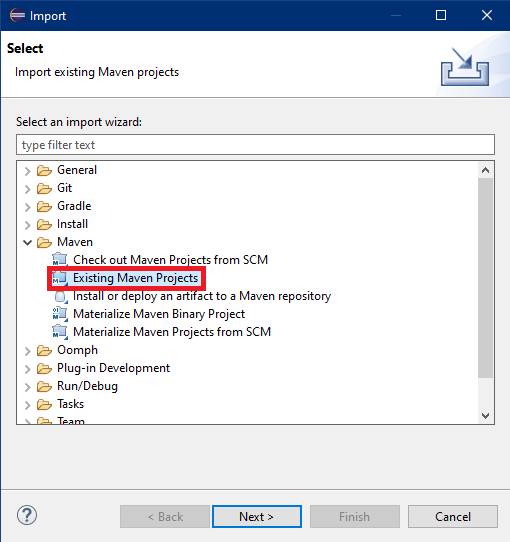

- Clique em *"Browse"* e selecione a pasta "patec" (que é o projeto Maven em questão).

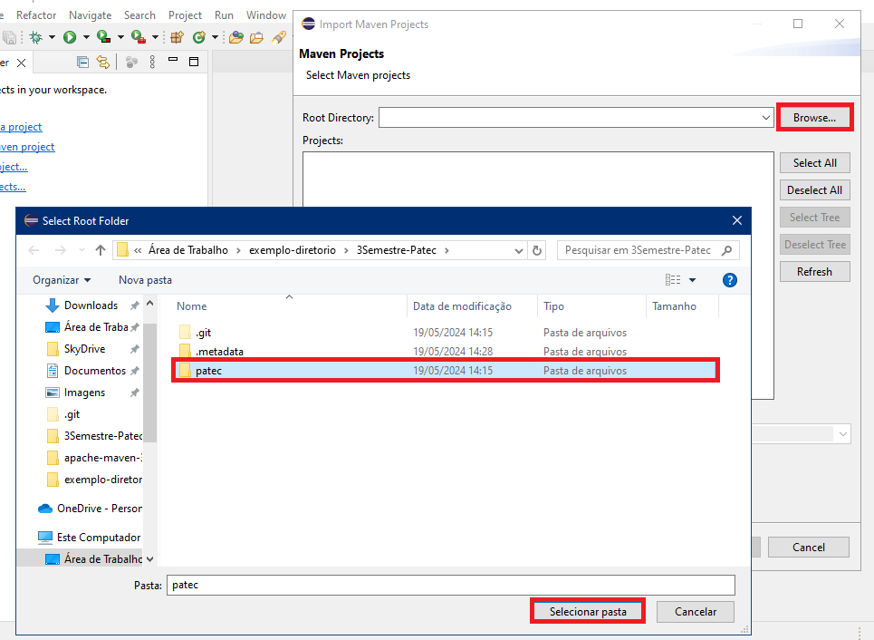

- Perceba que apareceu o arquivo pom.xml (em amarelo). É nele que ficam as dependências Maven do projeto (como o JDatePicker, por exemplo). Por fim, clique em *"Finish"*.

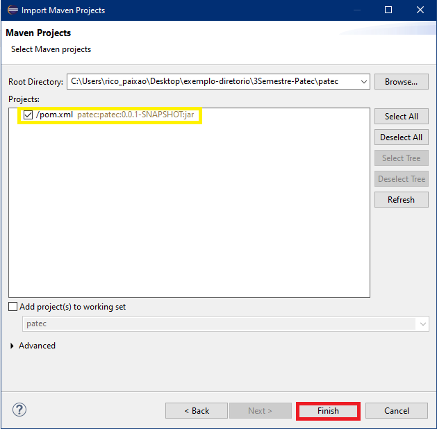

## Configurando o SQL Server:

Para poder utilizar o projeto em conjunto com o SQL Server, é necessário configurá-lo para que a Patec seja capaz de acessar o banco de dados. Veja como fazer:

### Primeiro passo: Configurar o usuário "sa":

1. Abra o SQL Server. Quando a janela de conexão for exibida, realize a conexão utilizando a Autenticação do Windows, conforme exibido em amarelo. Em seguida, clique em "Conectar".

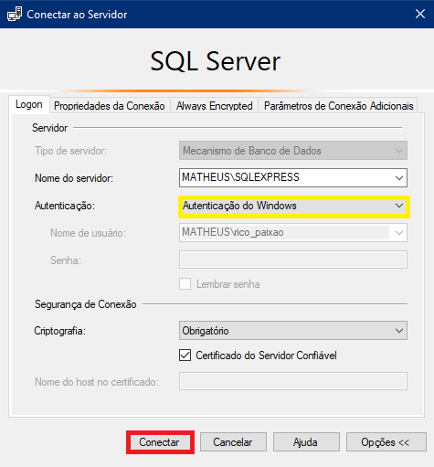

2. Clique com o botão direito sobre a conexão (no exemplo, "MATHEUS\SQLEXPRESS (SQL Server 16.0.1115 - MATHEUS\rico_paixao)"), e em seguida clique em "Propriedades".

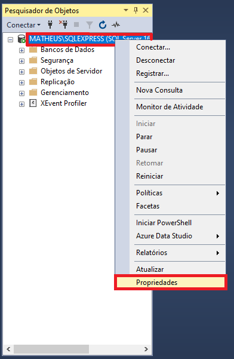

3. Em "Segurança", selecione "Modo de Autenticação do SQL Server e do Windows", e clique em "OK".

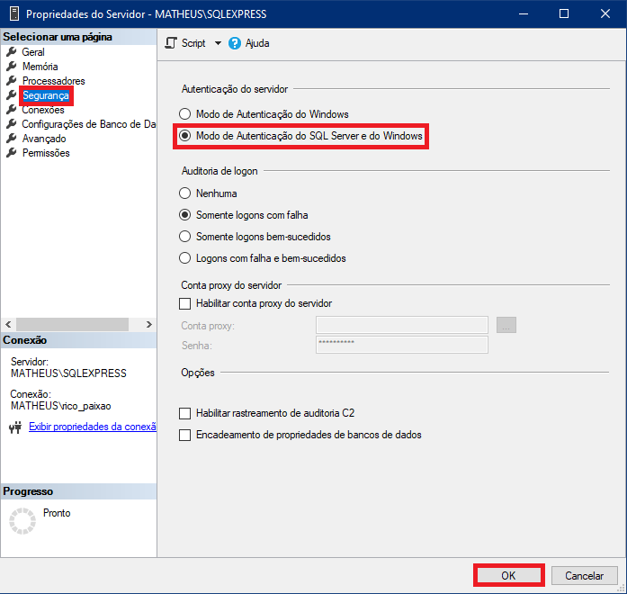

4. De volta à janela principal, clique em **Segurança > Logons > sa > Propriedades**.

> [!NOTE]
> O usuário "sa", que selecionamos, é o usuário padrão que SQL Server cria quando o instalamos. É por meio dele e de sua respectiva senha que realizaremos a conexão entre a Patec e o SQL Server.

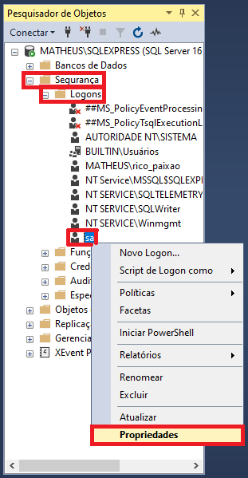

5. Insira a senha e a repita.

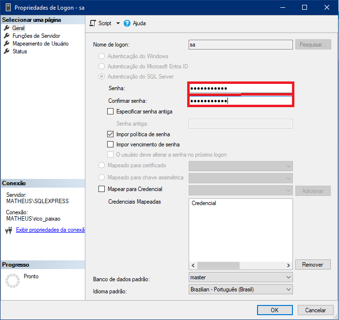

6. Em "Status", selecione "Habilitado" na área "Logon", e clique em "OK".

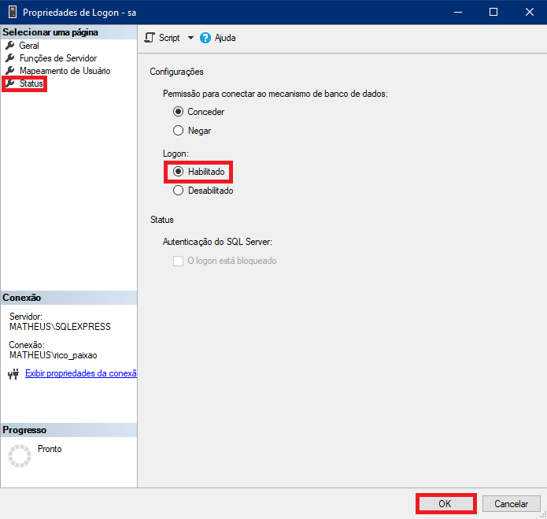

7. Clique novamente com o botão direito sobre a conexão, e clique em "Reiniciar".

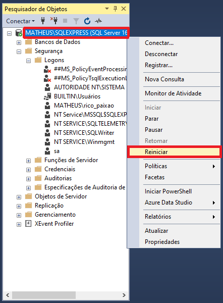

> [!NOTE]
> Caso a janela de conexão não apareça, clique em **Conectar > Mecanismo de Banco de Dados**.
>
> 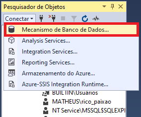

8. Altere a autenticação para "Autenticação do SQL Server", insira os dados de log-in e clique em "Conectar".

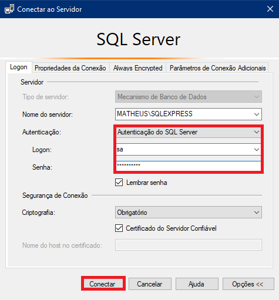

### Segundo passo: Configurar o *localhost*:

1. Abra o SQL Server Configuration Manager. Clique em **Configuração de Rede do SQL Server > Protocolos para SQLEXPRESS** e habilite o TCP/IP clicando com o botão direito e em "Habilitar".

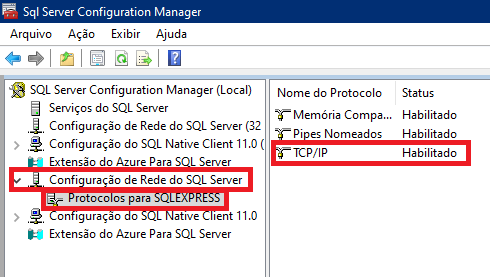

2. Clique com o botão direito novamente, e selecione "Propriedades".

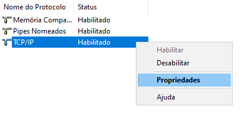

3. Clique em "Escutar Tudo", e selecione "Sim".

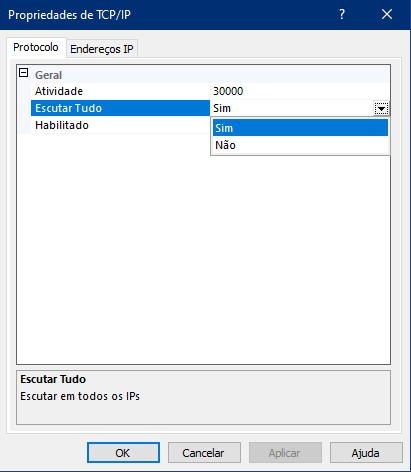

4. Clique em "Endereços IP", role até o final da lista e você verá o IPAII. Em "Porta TCP", insira o valor 1433.

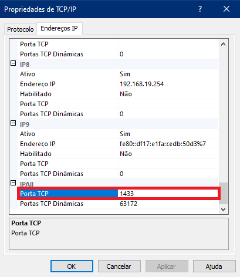

5. Clique em "Aplicar", e em "OK".

6. De volta à janela principal, clique em "Serviços do SQL Server", clique em "SQL Server (SQL EXPRESS)" com o botão direito e, por fim, clique em "Reiniciar".

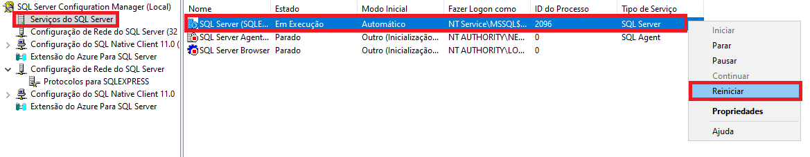

## Sugestões de leitura/para assistir depois:

- [Como escrever boas mensagens de commit: um guia prático do Git](https://www.freecodecamp.org/portuguese/news/como-escrever-boas-mensagens-de-commit-um-guia-pratico-do-git/) - por freeCodeCamp
- [Padrão de commits](https://github.com/iuricode/padroes-de-commits?tab=readme-ov-file) - por Iuri Silva
- [Git Cheat Sheet (pt-BR)](https://training.github.com/downloads/pt_BR/github-git-cheat-sheet.pdf) - por GitHub
- [Mini Curso de Git](https://www.youtube.com/watch?v=ts-H3W1uLMM) - Por Código Fonte TV
- [Connect Java to a MySQL Database (em inglês)](https://www.baeldung.com/java-connect-mysql) - por baeldung
- [A Visual Guide to Layout Managers (em inglês)](https://docs.oracle.com/javase/tutorial/uiswing/layout/visual.html) - por Oracle